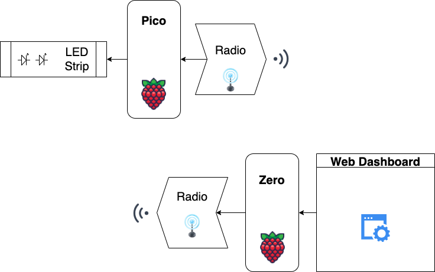

# Raspberry PI Pico - TV Backlight Project

The aim of this project is to connect a neopixel LED strip to a Pico and communicate via a RFM69HCW Radio to a Raspberry PI Zero where a web application is hosted to control the colour and pattern.

## Hardware & Components

Here is a list of the components used in this project and documentation links to get started.

1. **Raspberry Pi Pico** - https://www.raspberrypi.com/documentation/microcontrollers/raspberry-pi-pico.html
2. **Raspberry Pi Zero** - https://www.raspberrypi.com/documentation/
3. **Flexible RGBW LED Strip** - https://shop.pimoroni.com/products/flexible-rgbw-led-strip-neopixel-ws2812-sk6812-compatible?variant=30260032667731
4. **RFM69HCW Radio** - https://learn.adafruit.com/adafruit-rfm69hcw-and-rfm96-rfm95-rfm98-lora-packet-padio-breakouts

## Basic Project Layout



## Set Up

**Pico**

Here are some helpful links to get started with understanding the Pico software:

- Circuit Python Installation: https://learn.adafruit.com/getting-started-with-raspberry-pi-pico-circuitpython/circuitpython

- Circuit Python Pico Pins: https://learn.adafruit.com/getting-started-with-raspberry-pi-pico-circuitpython/circuitpython-pins-and-modules

- Radio Breakout Installation: https://learn.adafruit.com/adafruit-rfm69hcw-and-rfm96-rfm95-rfm98-lora-packet-padio-breakouts/circuitpython-for-rfm69

**Zero**

Here are some helpful links to get started with the PI Zero and it's software:

- Connecting to Zero via USB cable: https://howchoo.com/pi/raspberry-pi-gadget-mode

**Documentation**

- RFM69 Documentation - https://docs.circuitpython.org/projects/rfm69/en/latest/api.html#adafruit-rfm69
- RFM69 Software - https://learn.adafruit.com/adafruit-rfm69hcw-and-rfm96-rfm95-rfm98-lora-packet-padio-breakouts/advanced-circuitpython-rfm69-library-usage

### Installing Node on the PI Zero

The raspberry PI uses a Broadcom BCM2835 SoC, which has an ARM processor that uses an ARMv6 instruction set. Unfortunately Nodejs does not support the ARMv6 build, so you have to download an unofficial version of node to get version 12 or higher.

firstly download the unofficial version of node you want, used:

```bash
wget https://unofficial-builds.nodejs.org/download/release/v16.15.0/node-v16.15.0-linux-armv6l.tar.xz
```

In the same directory as the downloaded file, extract it using this command:

```bash
tar xJvf node-v16.15.0-linux-armv6l.tar.xz
```

Copy the contents of the extracted tarball file to usr/local running this command:

```bash
sudo cp -R node-v16.15.0-linux-armv6l/* /usr/local/
```

And then remove everything as you don't need it anymore:

```bash
rm -rf node-*
```

Next, reboot the PI to test if node and npm have been installed correctly:

```bash
sudo reboot
```

### Installing Git on Zero

To download the code needed to run this project, and in case you haven't already installed git on the PI, run these commands:

```bash
sudo apt update
sudo apt install git
```

To configure your Git profile, run these commands:

```bash
git config --global user.name "Your Name"
git config --global user.email "youremail@yourdomain.com"
```

Check you have configured it correctly:

```bash
git config --list
```
